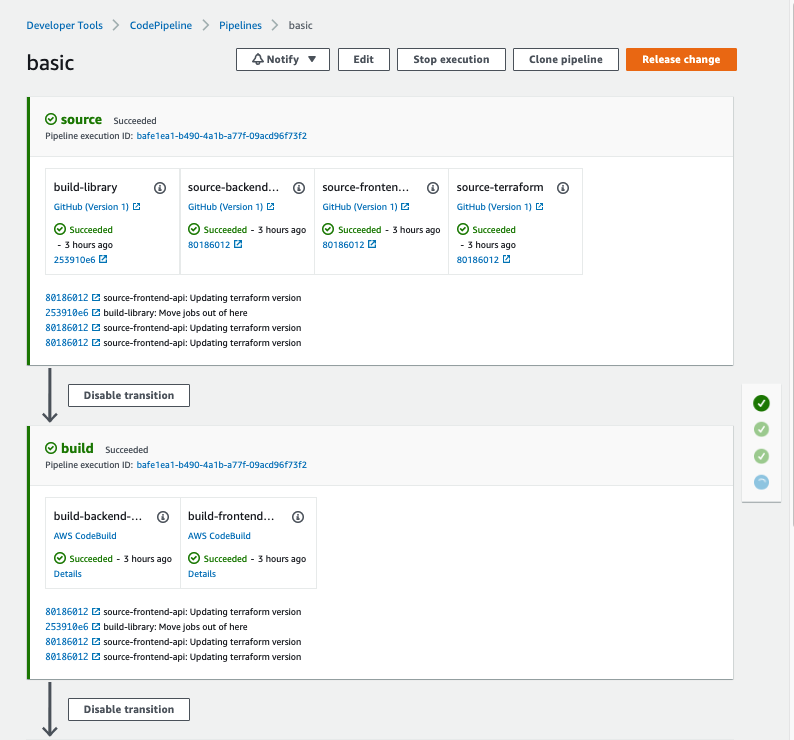
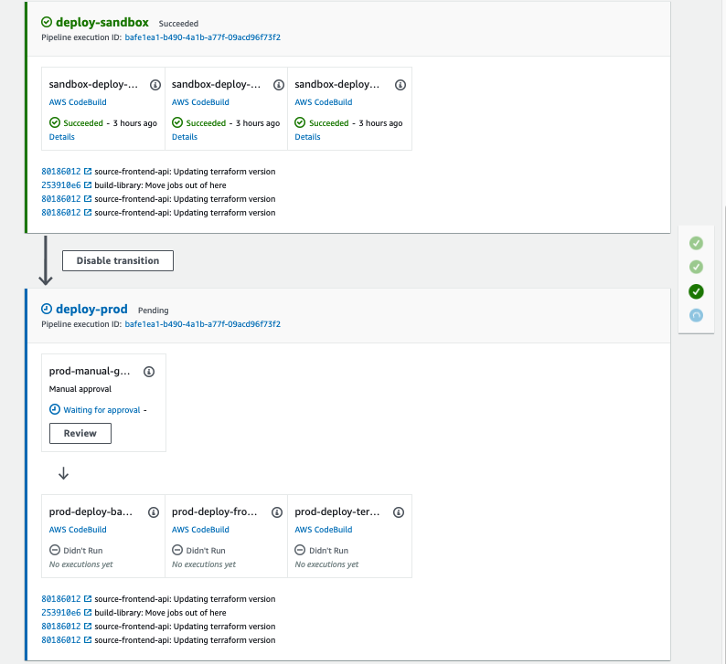
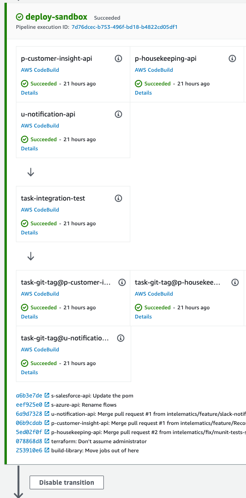
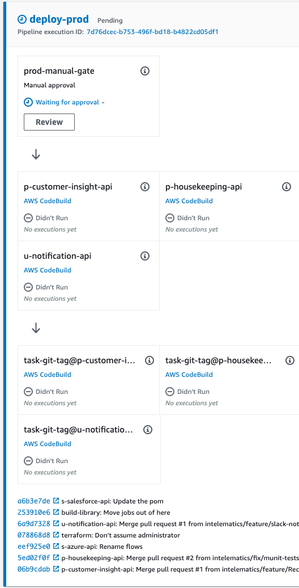

# Code Pipeline

[Description](#description)

[Example](#example)

[After Deployment Tasks](#after-deployment-tasks)

## Description
Deploys a basic codepipeline.  This is however fully configurable, allowing for multiple environments, and multiple projects
It also supports a build library, this may be used to house long variables and settings required for building (eg maven settings).
This module will produce everything required to make this function, including the S3 bucket and roles.

A project is capable of being either in a build phase (eg a library), a deploy phase (eg terraform) or both (eg a mulesoft job)

By default the jobs are named consistently:
>  **build:**  `build-<PROJECT>`
>
>  **deploy:** `<ENVIRONMENT>-deploy-<PROJECT>`
however this can be changed as required (see `build_project_template` and `deploy_project_template`

Some additional environment variables are sent to codebuild jobs:
* `PIPELINE_PROJECT_NAME` - Name of the project that this build/deploy is running against
* `PIPELINE_ENVIRONMENT`(deploy) - The environment this deployment is being deployed against
* `SOURCE_GITHUB_SHA` - Github's SHA that produced this build 
* `PIPELINE_EXEC_ID` - Pipeline execution id - this is pretty much the only unique id for a build


A fully working example of this is at [intelematics/mule-anypoint-bastion-cicd](https://github.com/intelematics/mule-anypoint-bastion-cicd/blob/master/build-pipeline/codepipeline.tf)


## Example

Example of a pipeline (including codeBuild):


```
### Build Pipeline - 2 environments, with 2 projects, and a terraform
module "basic_pipeline" {
  source = "git@github.com:intelematics/tf-modules-common.git//codepipeline"
    
  github_auth_token = local.github_auth_token

  bucket_prefix = "ia-example"
  build_library = {repo = "mule-build-library"}

  pipeline_name = "basic"
  environments = [{ name: "sandbox",
                    gate: {type: "none"},},
                  { name: "prod",
                    gate: {type: "manual"},},
                 ]
  projects = { 
      frontend-api: {build: true, deploy: true, repo: "frontend-api"},
      backend-api: {build: true, deploy: true, repo: "backend-api"},
      
      terraform: {build: false, deploy: true, repo: "mule-anypoint-bastion"},
    }

  tags = local.tags
}


### CodeBuild jobs to build 
module "basic_build" {
  source = "git@github.com:intelematics/tf-modules-common.git//codebuild"
  for_each = toset(["backend-api", "frontend-api"])
  
  bucket_prefix = "ia-basic"
  github_auth_token = local.github_auth_token

  codebuild_project_name = each.value
  buildspec = file("buildspecs/basic.yml")
  project = {
    repo: "basic-${each.value}"
  }
  environment = "build"
  environment_variables = {
    SPECIAL_VAR: "Special Build for ${each.value}",
  }

  tags = local.tags
}

### CodeBuild jobs to deploy 
module "basic_deploy" {
  source = "git@github.com:intelematics/tf-modules-common.git//codebuild"
  for_each = {for key in setproduct(["backend-api", "frontend-api"], ["sandbox", "prod"]) : "${key[0]}${key[1]}" => key}
  
  bucket_prefix = "ia-basic"
  github_auth_token = local.github_auth_token

  codebuild_project_name = "deploy-${each.value[0]}"
  buildspec = file("buildspecs/basic.yml")
  project = {
    repo: "basic-${each.value[0]}"
  }
  environment = each.value[1]
  environment_variables = {
    SPECIAL_VAR: "Special Deploy for ${each.value[0]}, environment: ${each.value[1]}",
  }

  tags = local.tags
}
```

The above code produces the below pipeline




## After Deployment Tasks
It is also possible to run additional tasks after the deploy step, build variables may
be passed to it, and the step may be run once, or for all projects.

the following additional environment variables may be used:
* `PIPELINE_SOURCE_OWNER` - The source's git org
* `PIPELINE_SOURCE_REPO` - The source's git repo name
* `PIPELINE_SOURCE_BRANCH` - The source's git branch

`projects` can be specified as either:
* nothing - only once per execution
* `["BUILD"]` - all build jobs
* `["DEPLOY"]` - all deploy jobs
* `["<projectname1>", "<projectname2>", ...]` - specific projects

The `codebuild` project name specified which codebuild job to use, this may include `<PROJECT>`, which will automatically append in the project name as shown in the example.

The following is a basic example of performing an integration test and a tag before
completing the stage.  This is valuable to record what has been deployed after the
deployment is successful.

```
  environments = [{ name: "sandbox",
                    after_deploy: [ { codebuild: "task-integration-test"},
                                    { codebuild: "task-git-tag", 
                                      projects: ["DEPLOY"],
                                      environment_variables: {
                                        TAGS: "release-<PIPELINE_EXEC_ID_SHORT> release-<PIPELINE_EXEC_ID_SHORT>-<PIPELINE_ENVIRONMENT>",
                                        BRANCH: "sandbox"
                                      }},
                                    { codebuild: "task-release-<PROJECT>", 
                                      projects: ["BUILD"],
                                      },
                                  ]
                    },
                  { name: "prod",
                    gate: {type: "manual"},
                    after_deploy: [ { codebuild: "task-git-tag", 
                                      projects: ["DEPLOY"],
                                      environment_variables: {
                                        TAGS: "release-<PIPELINE_EXEC_ID_SHORT>-<PIPELINE_ENVIRONMENT>",
                                        BRANCH: "prod"
                                      }
                                  },]
                    },
                 ]
```

This creates the following pipeline (this does the same for prod):




## Pushing data between steps
Within codepipeline you can move data between steps using Artifacts and Variables.

Artifacts are automatically setup from the source to build, and from build to deploy (if a build step exists, otherwise source). 
For anything that is created this is a good place to store it. For anything that is determined, but not part of the build use variables

Variables are sent between actions in code pipeline by using namespaces. Namespaces are automatically created for all tasks, and variables marked
as exported will be available to future build steps, referenced by namespace. eg:

`buildspec.yml` in the build of `my-project`
```
version: 0.2

env:
  shell: shell-tag
  exported-variables:
    - VERSION
phases:
  post_build:
    - VERSION=21
```

Would be available using the format `#{Build_my-project.VERSION}` this can then be setup in an after deploy step like:
```
                    after_deploy: [ { codebuild: "task-record-version", 
                                      projects: ["BUILD"],
                                      environment_variables: {
                                        BUILD_VERSION: "#{Build_my-project.VERSION}"
                                      }
                                  },]
```
Further info on this can be found at:

* [buildspec Reference](https://docs.aws.amazon.com/codebuild/latest/userguide/build-spec-ref.html)
* [CodePipeline - Actions - Working with variables](https://docs.aws.amazon.com/codepipeline/latest/userguide/actions-variables.html)
